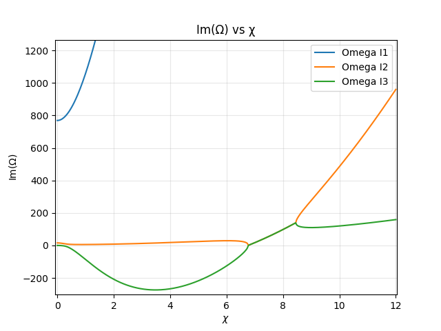

<h3>Computational Modeling of a Lithium Magnetoplasmadynamic Thruster for Nuclear Electric Propulsion</h3>

<strong>Program:</strong> NASA NSTGRO 
<strong>Institution:</strong> Stanford University 
<strong>Principal Investigator:</strong> Mark Cappelli (Stanford) 
<strong>NASA Research Collaborator:</strong> Kurt Polzin (NASA Marshall Space Flight Center)

<h4>Objective</h4>

High-power electric propulsion, including Nuclear Electric Propulsion (NEP), is a promising technology for future crewed and cargo missions to Mars. For high-power spacecraft, the self-field MPD configuration is especially attractive because it delivers strong performance.

A major barrier to operating MPDs at high current, which enables high specific impulse, is <em>onset</em>: a transition associated with large voltage fluctuations and severe anode erosion when the current exceeds a threshold. Onset is influenced by propellant choice, mass flow rate, and thruster geometry. However, its underlying causes remain insufficiently understood, and conventional computational tools such as MHD do not capture the physics that appears central to onset.

<strong>Objective:</strong> develop a predictive, physics-based simulation framework capable of predicting onset, to guide design and operating conditions that extend thruster lifetime for MPD thrusters relevant to Mars missions.

<h4>Technical contribution</h4>

By retaining non-equilibrium thermodynamics and ionization dynamics, the formulation captures electrothermal behavior that single-fluid MHD cannot.

<h5>Linear stability model</h5>

I implemented a two-fluid, 1D formulation derived for the near-anode region, where instabilities are most critical. In this framework, electrons and heavy species are treated with separate energy balances, enabling non-equilibrium between electron temperature and gas temperature. The model explicitly includes ionization and recombination kinetics, ambipolar diffusion, Ohmic heating with Spitzer conductivity, viscous dissipation, and electron–heavy species energy exchange.

The governing equations are nondimensionalized, yielding a cubic dispersion relation whose roots provide the local instability growth rate as a function of the normalized axial wavenumber.

<h5>One-dimensional two-fluid solver and coupling strategy</h5>

To evaluate stability from computed plasma states, I developed a 1D two-fluid solver that computes the axial evolution of plasma properties along the channel, including:

<ul>
  <li>mass and momentum,</li>
  <li>electron density,</li>
  <li>electron temperature and heavy-species temperature,</li>
  <li>self-induced magnetic field,</li>
  <li>consistent chemistry terms: ionization–recombination, ambipolar diffusion, Ohmic heating, electron thermal conduction, and wall losses.</li>
</ul>

I then coupled the 1D solver to the 0D stability model: the solver provides axial profiles, a near-anode state is extracted, and the stability module computes the growth rate and evaluates an onset criterion for a magnetic field <em>B</em> that increases up to onset. For a given geometry, this workflow can be used to sweep operating conditions and record onset thresholds when the instability criterion is exceeded.

<h4>Results</h4>

This coupled system was validated by reproducing key trends reported in the experimental literature:

<ul>
  <li><strong>Stability maps:</strong> growth rate vs. nondimensional wavenumber shows alternating stable and unstable bands.</li>
  <li><strong>Current density sensitivity:</strong> increasing discharge current density increases instability growth rate and narrows the stable operating window.</li>
  <li><strong>Geometry correlation:</strong> for fixed mass flow rate, decreasing interelectrode length increases stability.</li>
  <li><strong>Ionization-fraction threshold:</strong> strong sensitivity to near-anode ionization fraction. Above a critical value (approximately α ≈ 0.875), small current increases can lead to rapid stability loss.</li>
</ul>

<!-- Replace image paths below with your actual figure exports -->

  
  Figure 4 — Growth rate vs. wavenumber at J = 2.0 × 10^6 A/m2.

  
  Figure 5 — Growth rate vs. wavenumber at J = 5.0 × 10^6 A/m2.

  
  Figure 6 — Growth rate vs. interelectrode separation / electrode length.

  
  Figure 7 — Growth rate vs. ionization fraction α.

